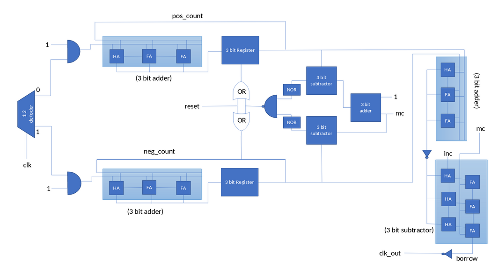
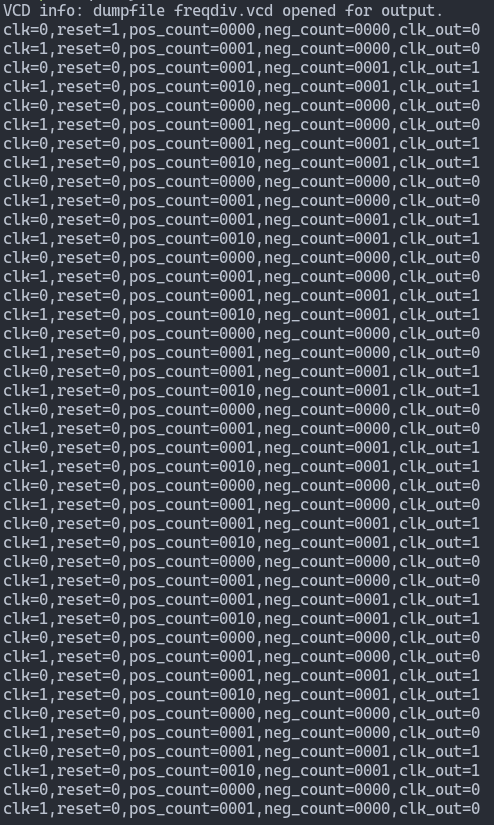
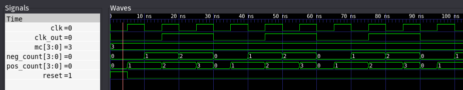
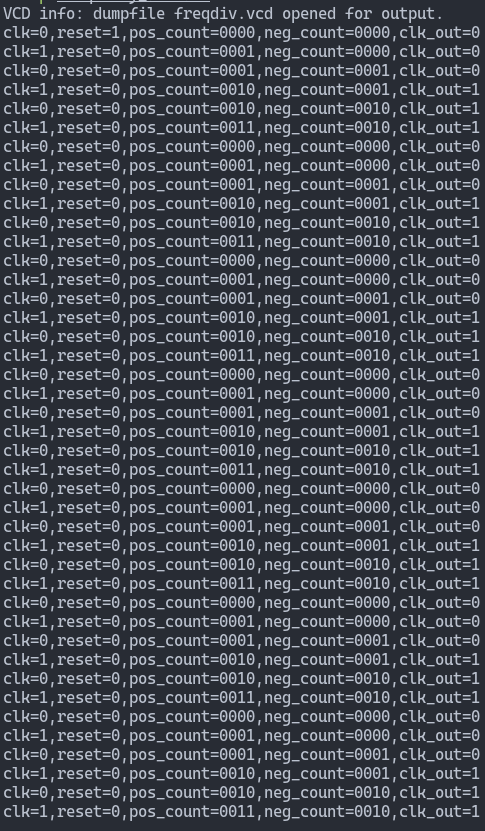
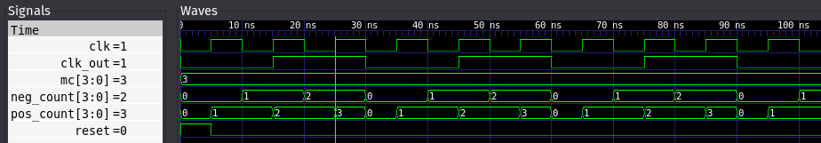

# 2-by-3-frequency-divider
### CONTRIBUTORS: Arunvenkat C.A., Ashutosh, Ashutosh Routray, Claudius D'Souza
## Abstract of the project:
### Aim: Design an algorithm to simulate a 2-by-3-frequency divider in iverilog .
### Working
- Has 2 inputs, the clock signal clk and the modulus control signal mc .
- The program divides the input frequency signal by reading the modulus control or mc value. (This is specified in the testbench)

| Value of `mc` |   Operation   |
|---------------|---------------|
| `0010`        | Divide by 2   |
| `0011`        | Divide by 3   |

- The program runs of trackers for the main clock line clk based on positive and negative edges which triggers the output clock lines clk_out accordingly.
- The above is simulated using flip-flops, multiplexers, subtractors, decoders, registers and ripple carry adders.
## Components:
Few major components used are Ripple carry adders, subtractors, decoders and registers.
1. Decoders: A combinational logic circuit that takes an n coded input and generates a maximum of 2 unique outputs. In this project we make use of 1:2 decoder to divide the clock signal.
2. Ripple carry adder: A combinational logic circuit used to add 2 n-bit binarynumbers (in our case 2 3-bit binary numbers). It consists of 1 half adder and n-1 full adders. Each adder generates a single bit output which is the sum of two corresponding single bit inputs. The carry generated from each adder is passed on to the next adder as input.
3. Registers: These are collection of flipflops, wherein each flipflop is used to store single bit data.Thus for an n bit input data to be stored, a n bit register is used which consists of n flipflops
4. Subtractors: It is a combinational logic circuit used to perform subtraction of 3 input bits, minuend, subtrahend and borrow in. It generates two outputs, difference and borrow out. Subtractors consist of n full adders and n half adders.
## Circuit Diagram:

The ÷2/3 circuit employs an OR gate to permit ÷3 operation if the modulus control (MC) is low or ÷2 operation if it is high.
## Output Screenshots
Execution command:
```
# for MC = 2
iverilog -o frequency_divider frequency_divider.v frequency_divider_tb_2.v
# for MC = 3
iverilog -o frequency_divider frequency_divider.v frequency_divider_tb_3.v
```
VVP Screenshot for MC=2:
<br>

<br><br>
GTKWave Screenshot for MC=2:
<br>

<br><br>
VVP Screenshot for MC=3:
<br>

<br><br>
GTKWave Screenshot for MC=3:
<br>

<br><br>
## Applications:
Frequency Divider Circuits or Frequency Dividers are an integral part of many communication and audio based systems like:
1. Frequency Synthesizers
2. Audio Equipment
3. Radar and Satellite Communication
4. Military Equipment
5. RF Devices
